# Obby Template
## 📢 About
Nice to meet you Creators! 👋 Welcome to obby template guide!
With Obby you can create amazing parkour worlds to play with your friends!
Now, are you ready to get started?

## ❓ How to create with obby template
:wrench: Installation and settings
- Download Unity Hub and Unity 2020.3.9f1 version. ([Download](https://unity.com/releases/editor/archive))
- Pull the repository.

> 💡 Enjoy and start creating with Obby Template! :tada:

## 🔨 Tools
- **GameSettings**: General game statistics and settings
                    
| Name     | Functionality                                                             |
| -------- | ------------------------------------------------------------------------- |
| `Levels` | This is the list of level prefabs, they appears on the order of the list. |

 
  </img> 
 
  - **UI Manager**: General game statistics and settings
Have the UI references and the configuration for the user of the timer.

------------------------------------------------------------------------------------------------------------
| Name              | Functionality                                                               |
| ----------------- | --------------------------------------------------------------------------- |
| `Game Duration`   | Total time that the game lasts, after this time a game over screen appears. |
| `Use Timer`       | If this value is true, a timer will appear on your screen                   |
| `Timer Panel`     | Reference to the timer panel object, it is on the Game Canvas.              |
| `Victory Panel`   | Reference to the victory panel object, it is on the Game Canvas.            |
| `Game Over Panel` | Reference to the Game Over panel object, it is on the Game Canvas.          |
| `Start Panel`     | Reference to the Start panel  object, it is on the Game Canvas.             |

  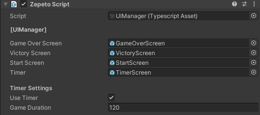</img> 

- **ObbyManager:** This script is very important for the functioning of the Obby template. Check that it is in scene.

## 🚧 Builds
- **Spawn Platform:** This is the first platform, it is used as the base of spawn. 
 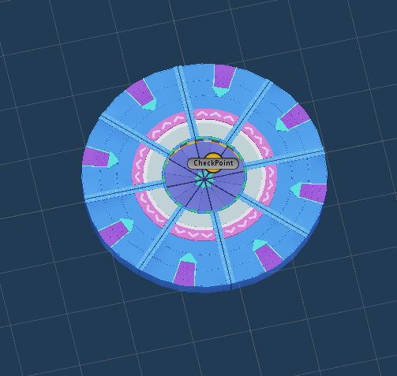</img>    
- **Death Road:** This is a sample for the death system.  
 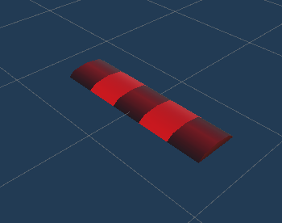</img> 
 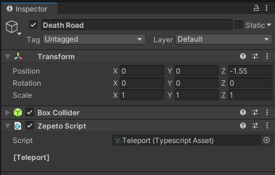</img>   
- **Teleport:** This is responsible for sending the player to the last saved position.You can edit the hitbox with the box collider 
 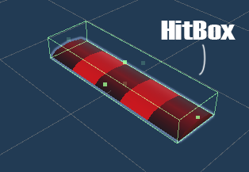</img>   
- **Fall Platform Builder:** 
 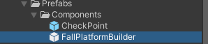</img> 

Use the ***FallPlatformBuilder*** component to build platforms that fall. 
Add it to the scene and then add the object you want as a child of the prefab.

Make sure the object you add contains the BoxCollider component with the
corresponding dimensions of the object.
 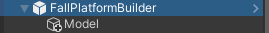 </img>  

Additionally, make sure that the object does not have the Static option enabled.
 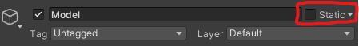 </img>  

#### *Fall Platform Structure:* 
 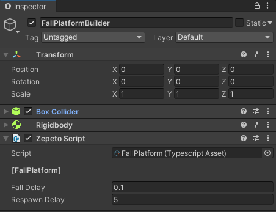</img>    

|                        |                                                                                              |
| ---------------------- | -------------------------------------------------------------------------------------------- |
| `Box Collider`         | Used to detect the player                                                                    |
| `Rigidbody`            | Used to realize the fall of the platform                                                     |
| ` FallPlatform Script` | **Fall Delay:** Time it takes to start falling.  **Respawn Delay:** Time it takes to respawn |

- **Goal Platform:** This platform is used as a goal, add it at the end of the level.
When the player passes over it a victory tab will appear.
 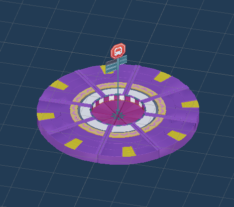</img> 

- **Move Platform:**
 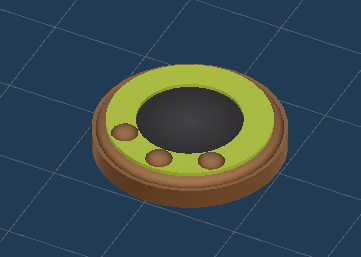</img>  
This platform can move along any axis setting the amount of movement that you want to the platform do and in how much time it takes to go back.
 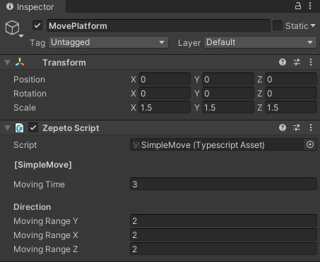</img> 

- **Level Prefab:**
You can find this prefab to create new levels, make a copy and work with the copy so you can make a lot of new levels from the base.
 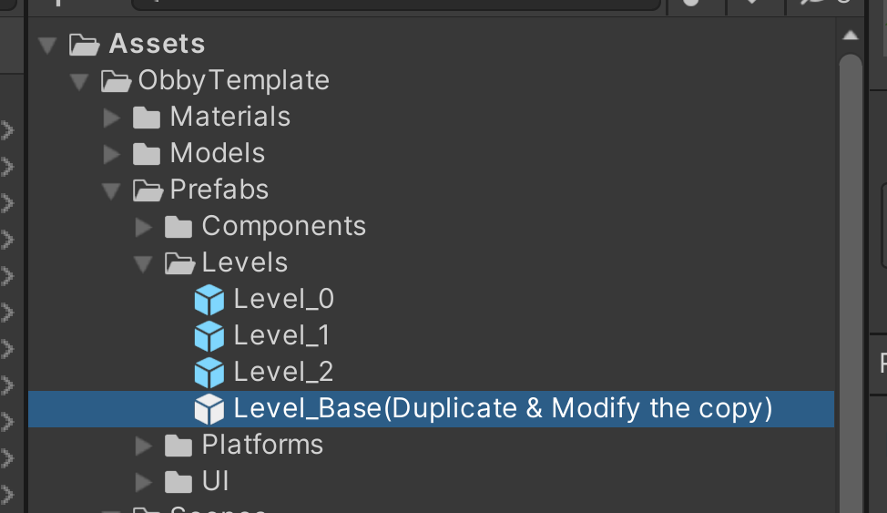</img>  
 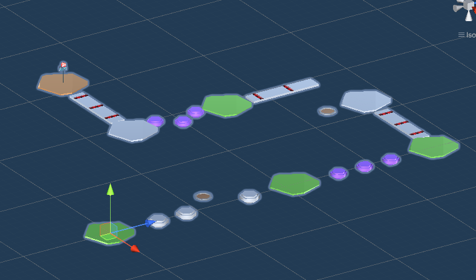</img>  
The level prefab contains a complete level, wich will be added to the "Levels"  array in "GameSettings".
Also the prefab have a "Level" script that have the SpawnPoint of the level.
 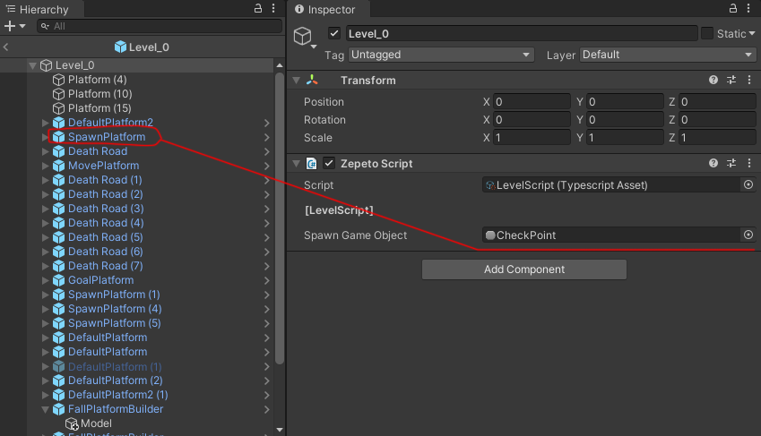</img>  

- **Check Point Prefab:** This is a empty gameObject that will be the check point to teleport the player when he loses.
 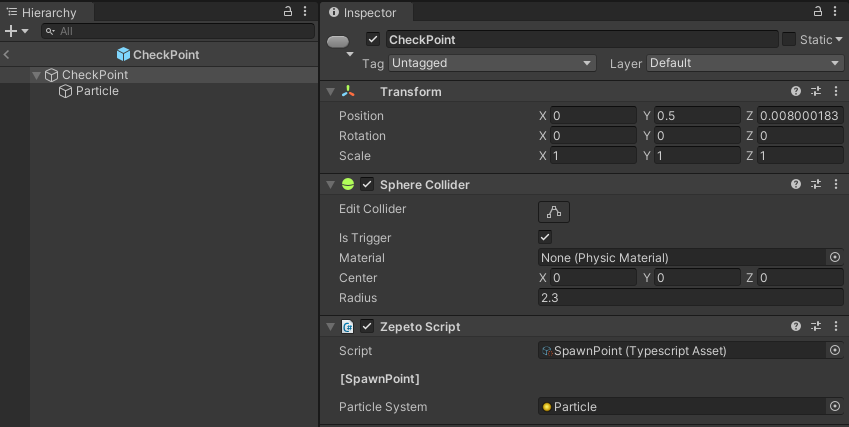</img>  
