# Obby Template
## 📢 About
Nice to meet you, Creators! 
👋 Welcome to the Obby template guide! With Obby, you can create amazing parkour worlds to play with your friends! 
Now, are you ready to get started?

## ❓ How to create with obby template
### :wrench: Installation and settings
- Download Unity Hub and Unity 2020.3.9f1 version. ([Download](https://unity.com/releases/editor/archive))

- Either pull the repository or click the green Code button on Github and then click Download ZIP to download it as a file.
- 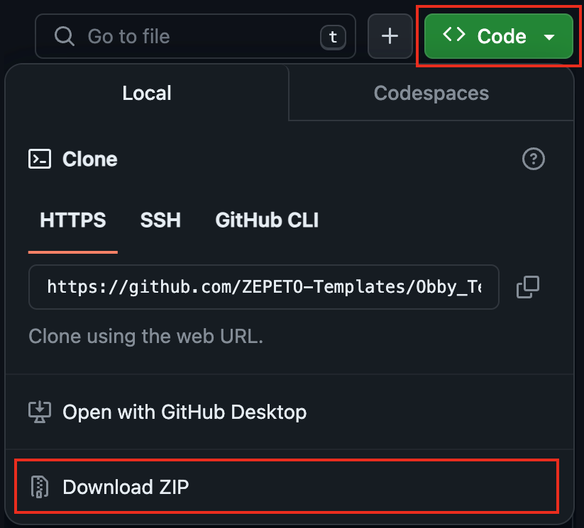</img>
 

- Run Unity Hub. Click the Add button and select your project folder.
- 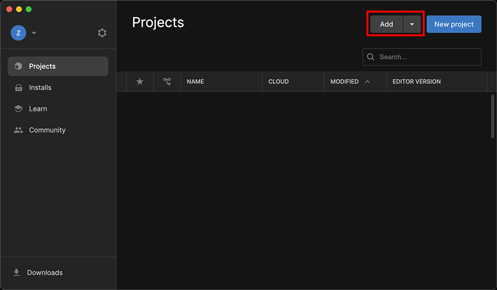</img>
 

- At this point, do not select the folder directly; navigate further into the ZEPETO Obby template folder until you see the Assets folder, then press the Open button.
- 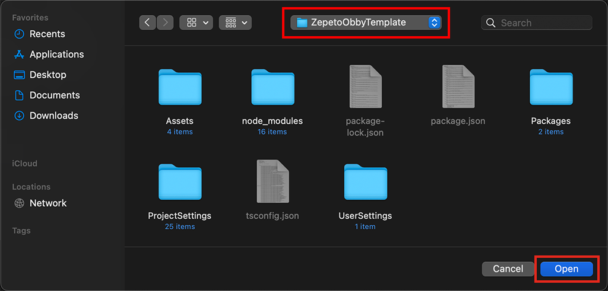</img>
 

- Once Unity Editor launches, open the Obby Scene file by double-clicking it.
- 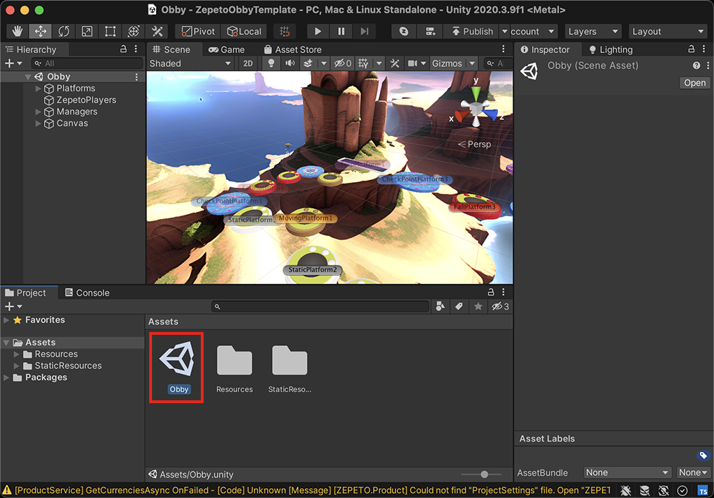</img>
 

- Log into your ZEPETO account in Unity Editor and press the Play button to start playing.
 

> 💡 Enjoy and start creating with Obby Template! :tada:

 

## 🚧 Builds

- **Spawn Platform :** This is the first platform, used as the base of spawn.
  - Appearance
  - 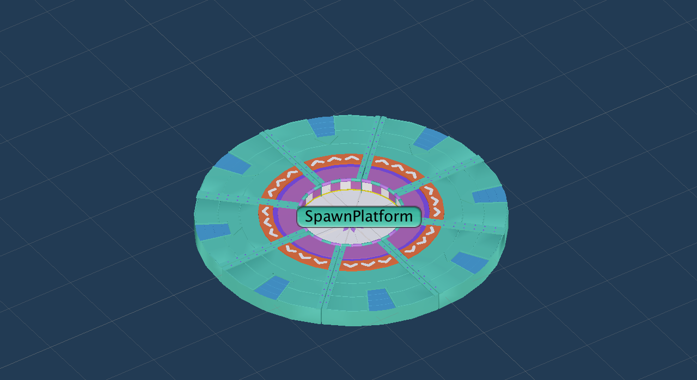</img>
  - Required Components
    - SpawnPlatform Script
    - Trigger Settings
    - 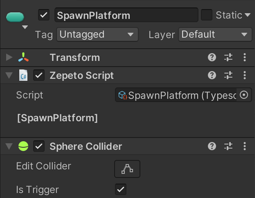</img>

  - :notebook: Note 
    - Please ensure only one exists in the Scene.
  

- **Trap Platform :** A sample for the death system. Stepping on it will return you to the most recently visited checkpoint.
  - Appearance
  - 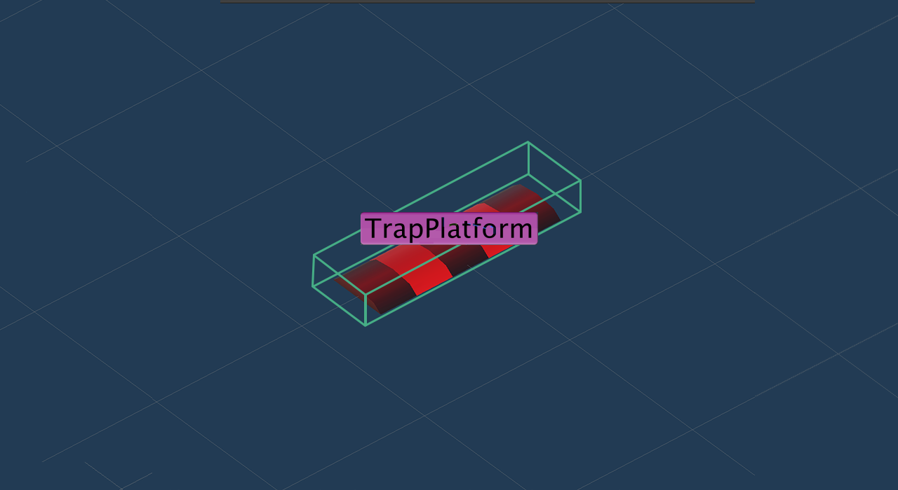</img>
  - Required Components
    - TrapPlatform Script
    - Trigger Settings
    - 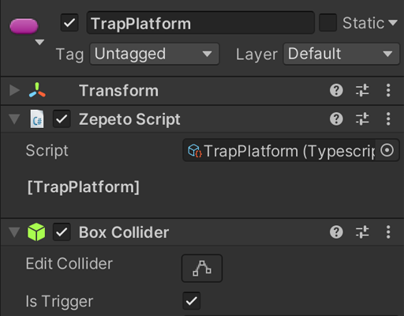</img>
  

- **Fall Platform :** Stepping on the platform will cause it to fall after a set time (in seconds) defined by Fall Delay, and it will respawn after a time set by Respawn Delay.  
  - Appearance
  - 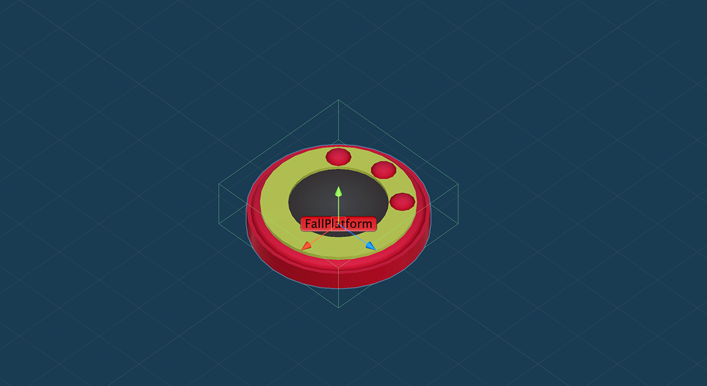</img>
  - Required Components
    - FallPlatform Script
      - Fall Delay : sets the delay before it falls
      - Respawn Delay : sets the delay before it respawns
    - Trigger Settings
    - 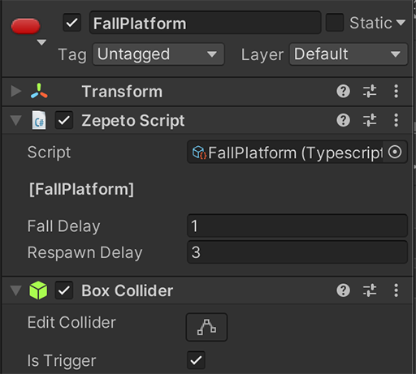</img>

  - :notebook: Note 
    - When customizing the Fall Platform's appearance, replace the child object (Ground_Model) with a different model, ensuring the Static property is unchecked. 
    - If the Static property is checked, it will not appear to fall.
    - 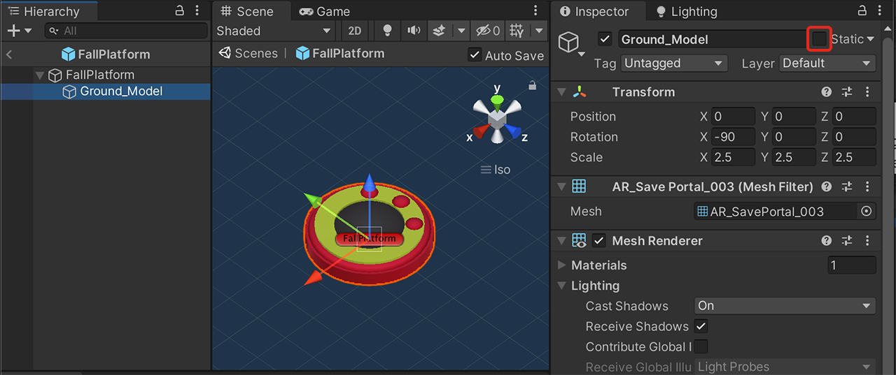</img>
  

- **Goal Platform :** Used as a goal, add it at the end of the level. When the player passes over it, a victory tab will appear.
  - Appearance
  - 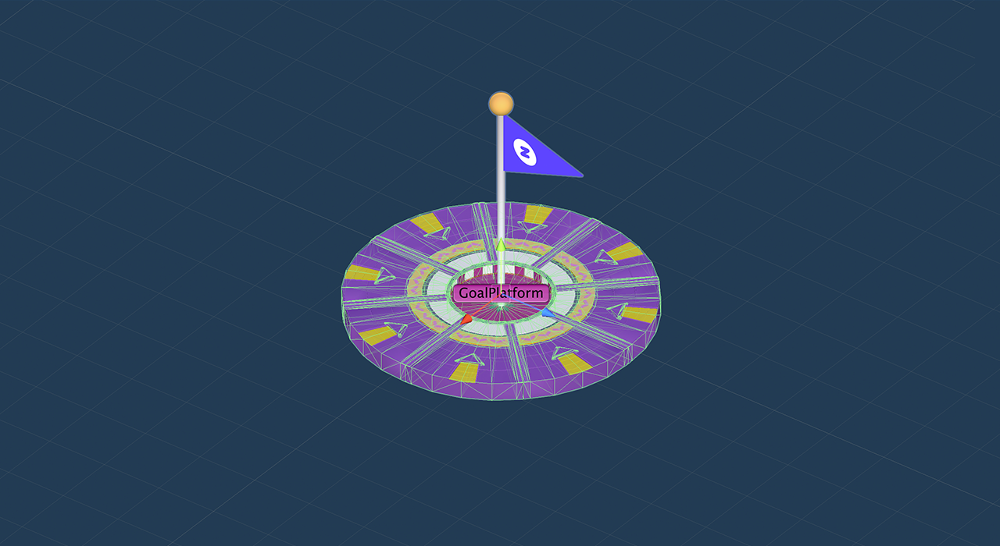</img>
  - Required Components
    - GoalPlatform Script
    - Trigger Settings
    - 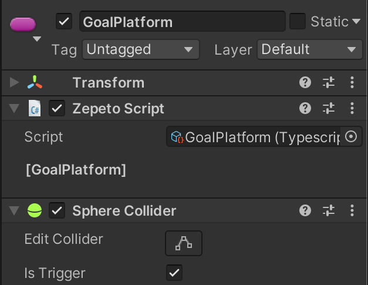</img>
  

- **MovingPlatform :** This platform can move along any axis. Set the movement amount and the time it takes to return.
  - Appearance
  - 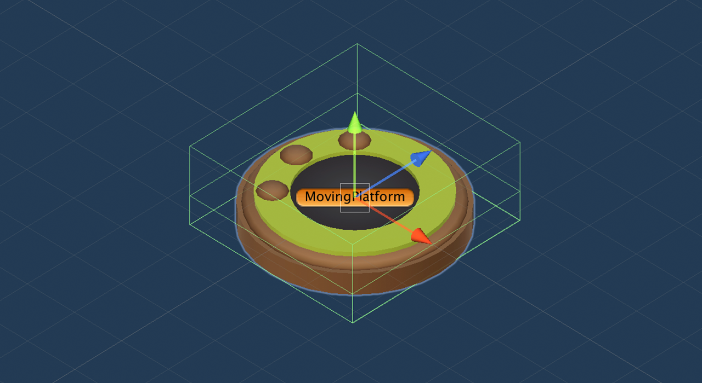</img>
  - Required Components
    - SimpleMove Script
      - Moving Time : The duration of movement
      - Moving Range X : The distance of movement along the X-axis
      - Moving Range Y : The distance of movement along the Y-axis
      - Moving Range Z : The distance of movement along the Z-axis
    - MovingPlatformCollision Script
    - Trigger Settings
    - 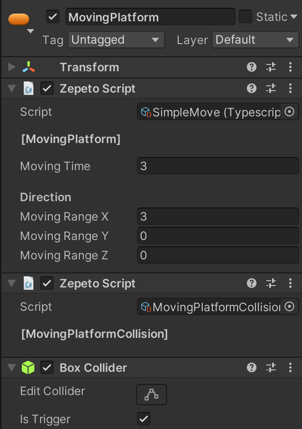</img>
  - :notebook: Note 
    - Only input values in the direction you want it to move, leaving the rest as 0.
    - When customizing the Fall Platform's appearance, replace the child object (Ground_Model) with a different model, ensuring the Static property is unchecked. 
    - If the Static property is checked, it will not appear to move.
  

- **Check Point Platform :** An empty gameObject that serves as the checkpoint to teleport the player upon loss.
  - Appearance
  - 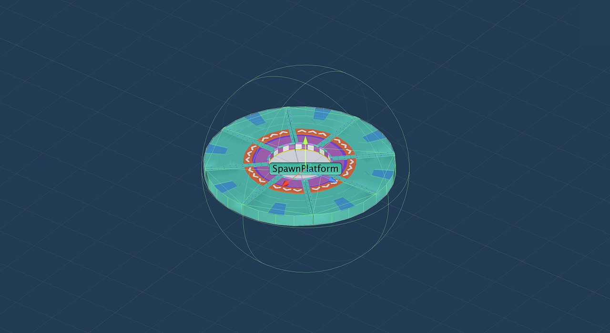</img>
  - Required Components
    - GoalPlatform Script
    - Trigger Settings
    - 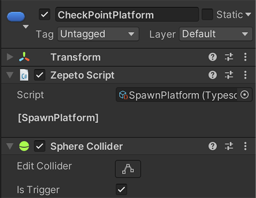</img>
  

## :clipboard: World Logics
-  **Managers :** Related to the world's execution logic.

| Name              | Functionality                                                               |
| ----------------- | --------------------------------------------------------------------------- |
| WorldSettings   | WorldSettings manages world states like start and restart.                    |
| UIManager       | UIManager invokes a UI allowing results checking and restart when the player reaches the goal.                     |
| ObbyManager     | ObbyManager manages player checkpoint saving.                                 |
| EventSystem   | EventSystem delivers player inputs to UI elements for interactions.             |
| Environment | Environment groups environmental elements like the Main camera or Scene lighting. |

- **UI**

| Name              | Functionality                                                               |
| ----------------- | --------------------------------------------------------------------------- |
| Result Panel   | Reference to the result panel object on the Canvas. You can directly modify the congratulatory text.                    |

 

## 🚀 Launch your own Obby world!

We sincerely thank you for using the ZEPETO Obby template.

We hope this template has helped you take the first step in world creation or allowed those familiar with world development to experiment with new ideas.

Thank you! :gift_heart:

 